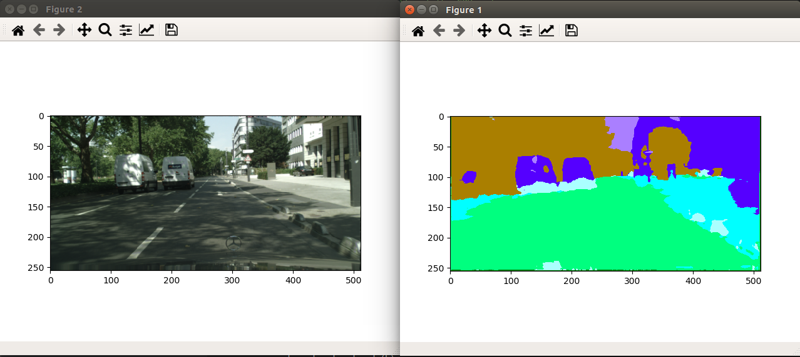

# Deep Learning: Image Segmentation using Encoder-Decoder Architecture

### Results!


### Directory Structure
```
.SegNet
├── cityscape
├── LICENSE
├── main.py                                    # Driver program                                 
├── models                                     # Folder containing the models                                  
│   ├── ConvDeconv.py                          
│   ├── ConvDeconvWithSkipConnection.py
│   ├── SegNet.py
│   ├── SegNetWithSkipConnection.py
│   └── testing.ipynb
├── README.md
└── weights                                    # Folder to store the weights
    └── weight
```
### Package dependencies
```
Python
Pytorch
Torchvision
matplotlib
numpy
sys
PIL
Time
```

### Dataset requirements
we need Cityscape dataset for this project. To download the cityscape dataset you neet to create account on [cityscape site](https://www.cityscapes-dataset.com/login/).
Once the account is setup go to download section and download following datasets.

**gtFine_trainvaltest.zip (241MB) [md5] and leftImg8bit_trainvaltest.zip (11GB) [md5]**

unzip the data set and ensure that the file structure looks the same as below and add the same in your SegNet directory
```
.cityscape
├── gtFine
│   ├── test
│   ├── train
│   └── val
└── leftImg8bit
    ├── test
    ├── train
    └── val
```

### How to run

#### 1. First of all, clone the repo:
```
$ git clone git@github.com:Suraj0712/SegNet.git
```
#### 2. Change the paths
Open the ```main.py``` file: 
1. Update the path on line number 20 ```data_path = "/home/sur/SegNet/cityscape/"``` with your path to cityscape directory
2. Update the path on line number 156, 224 ```"/home/sur/SegNet/weights/"``` with your path to weights directory
3. Optional: To visualize the output change ```output_visualization``` to 1. You can also change the learning rate and epoach 

#### 3. Loading the model
1. To change the model you have to uncomment the appropriate lines 46-50 in the main function 
2. By default script load Convolution-deconvolution model
3. Optional: uncomment the print statement if you want to see the details of the model

#### 4. Running the model
If your weight directory is empty then comment the line ```net.load_state_dict(torch.load('path to weight directory/wts_segnet.pth'))```
else comment the ```net = load_pretrained_weights(net)``` line and uncommnet the ```net.load_state_dict(torch.load('path to weight directory/wts_segnet.pth'))```
now you can run the model by executing 
```
for python2
$ python main.py
for python3
$ python3 main.py
```

#### 5. Credits
All this wouldn't have been possible without the valuable help I received from my classmates [Baladurgesh](https://www.linkedin.com/in/baladhurgesh/) , [Milan](https://www.linkedin.com/in/milan-r-shah/), and [Akshata](https://www.linkedin.com/in/akshata-pore-558242189/).

### Thank you!

